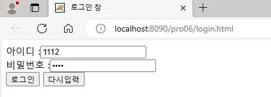

**Get 요청**

* 서버에서 어떤 데이터를 가져와서 보여줄 때 사용
* 어떤 값이나 내용, 상태 등을 바꾸지 않음
* HTTP 응답 코드: 200(OK)
* 리소스 전달 방식: 쿼리 스트링

 

**Post 요청**

* 서버 상의 데이터 값이나 상태를 바꾸기 위해서 사용
* HTTP 응답 코드: 201(CREATED)
* 리소스 전달 방식: HTTP Body
* => 생성, 수정, 삭제에 사용할 수 있지만, 수정은 PUT 또는 PATCH, 삭제는 DELETE를 주로 사용

 

**Get/Post 방식 보안성**

* Get방식은 URL 주소에 데이터를 붙여서 전송하므로 데이터가 노출되어 보안에 취약하다.
* Post방식은 데이터를 TCP/IP의 헤더에 숨긴 채로 전송하므로 URL 뒤에 아무것도 표시되지 않는다.

 

**Get 방식과 Post 방식 요청 동시에 처리하기**

* LoginServlet4.java

  

* **(Get 방식)**

* login.html

  

* 톰캣 서버 구동 후 http://localhost:8090/pro06/login.html 접속

  

* 결과 URL 및 콘솔 확인

  

  

* **(Post 방식)**

* login.html

  

* 톰캣 서버 구동 후 http://localhost:8090/pro06/login.html 접속

  

* 결과 URL 및 콘솔 확인

  

  