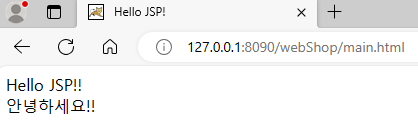

**웹 애플리케이션 기본 디렉터리 구조**

* 위와 같은 구조를 개발자가 직접 만들어 사용
* 그 후, 컨테이너에서 웹 애플리케이션을 실행
* 지금은 이클립스와 같은 개발 도구를 활용해, 톰캣 컨테이너에 등록 후 실행

 

1. **classes**: 웹 애플리케이션이 수행하는 서블릿과 다른 일반 클래스들이 위치하는 곳
2. **lib**: 웹 애플리케이션에서 사용되는 여러가지 라이브러리 압축 파일이 저장되는 곳. DB 연동 드라이브나 프레임워크 기능 관련 jar 파일 등
3. **web.xml**: 배치 지시자로서 일종의 환경 설정 파일

 

**webShop 웹 애플리케이션 작성**

* 디렉터리 구조

  

* web.xml

  

* main.html

  

 

**컨테이너에서 웹 애플리케이션 실행하기**

 

방법1) %CATALINA_HOME%webApp 디렉터리에 애플리케이션을 저장

* 톰캣 루트 디렉터리의 하위 디렉터리인 webapps 폴더, 작성한 웹 애플리케이션을 복사 후 위치시키고 톰캣을 다시 실행하면 톰캣이 자동으로 인식 후 실행

  

* 톰캣 서버 구동 후, http://127.0.0.1:8090/webShop/main.html 접속

  

 

방법2) server.xml에 직접 웹 애플리케이션 등록

* 임의의 장소에 위치해 있는 웹 애플리케이션을, 톰캣의 설정 파일인 server.xml에 등록해서 실행

* 디렉터리 구조

  

* server.xml에 context 추가

  

* 톰캣 서버 구동 후, http://127.0.0.1:8090/webMal/main.html 접속

  

 

