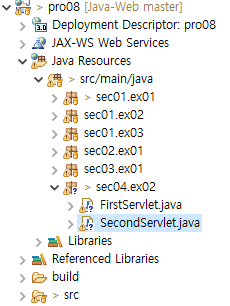
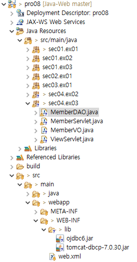

**바인딩**

* 대량의 데이터를 JSP로 전달할 때는 GET 방식이 불편하다.
* 그래서 서블릿에서 다른 서블릿 또는 JSP로 대량의 데이터를 공유하거나 전달할 때는 바인딩을 사용한다.
* 바인딩은 데이터를 서블릿 관련 객체에 저장하는 방법으로, 주로 HttpServletRequest, HttpSession, ServltContext 객체에서 사용된다.

<br>

1. HttpServletRequest를 이용한 dispatch 포워딩 시 바인딩

   * directory 구조

     

   * FirstServlet.java

     ```java
     package sec04.ex02;
     
     import java.io.IOException;
     
     import javax.servlet.RequestDispatcher;
     import javax.servlet.ServletException;
     import javax.servlet.annotation.WebServlet;
     import javax.servlet.http.HttpServlet;
     import javax.servlet.http.HttpServletRequest;
     import javax.servlet.http.HttpServletResponse;
     
     /**
      * Servlet implementation class FirstServlet
      */
     @WebServlet("/first")
     public class FirstServlet extends HttpServlet {
     	public void doGet(HttpServletRequest request, HttpServletResponse response) throws ServletException, IOException {
     		request.setCharacterEncoding("utf-8");
     		response.setContentType("text/html;charset=utf-8");
     		request.setAttribute("address", "서울시 성북구");
     		RequestDispatcher dispatch = request.getRequestDispatcher("second");
     		dispatch.forward(request, response);
     	}
     
     }
     ```

     * setAttribute()를 통해, 데이터를 객체에 바인딩한다.

   * SecondServlet.java

     ```java
     package sec04.ex02;
     
     import java.io.IOException;
     import java.io.PrintWriter;
     
     import javax.servlet.ServletException;
     import javax.servlet.annotation.WebServlet;
     import javax.servlet.http.HttpServlet;
     import javax.servlet.http.HttpServletRequest;
     import javax.servlet.http.HttpServletResponse;
     
     /**
      * Servlet implementation class SecondServlet
      */
     @WebServlet("/second")
     public class SecondServlet extends HttpServlet {
     	public void doGet(HttpServletRequest request, HttpServletResponse response) throws ServletException, IOException {
     		request.setCharacterEncoding("utf-8");
     		response.setContentType("text/html;charset=utf-8");
     		PrintWriter out = response.getWriter();
     		String address = (String) request.getAttribute("address");
     		
     		out.println("<html><body>");
     		out.println("주소:" + address);
     		out.println("<br>");
     		out.println("dispatch를 이용한 바인딩 실습입니다.");
     		out.println("</body></html>");
     	}
     
     }
     ```

     * getAttribute()를 통해, 각 객체에 바인딩된 데이터를 name으로 가져온다.

<br>

2. 두 서블릿 간 회원 정보 조회 바인딩

   * directory 구조

     

     * 디비 드라이버도 설정해준다.

   * MemberServlet.java

     ```java
     package sec04.ex03;
     
     import java.io.IOException;
     import java.io.PrintWriter;
     import java.util.List;
     
     import javax.servlet.RequestDispatcher;
     import javax.servlet.ServletException;
     import javax.servlet.annotation.WebServlet;
     import javax.servlet.http.HttpServlet;
     import javax.servlet.http.HttpServletRequest;
     import javax.servlet.http.HttpServletResponse;
     
     /**
      * Servlet implementation class MemberServlet
      */
     @WebServlet("/member")
     public class MemberServlet extends HttpServlet {
     	public void doGet(HttpServletRequest request, HttpServletResponse response) throws ServletException, IOException {
     		doHandle(request, response);
     	}
     
     	public void doPost(HttpServletRequest request, HttpServletResponse response) throws ServletException, IOException {
     		doHandle(request, response);
     	}
     	
     	protected void doHandle(HttpServletRequest request, HttpServletResponse response) throws ServletException, IOException {
     		request.setCharacterEncoding("utf-8");
     		response.setContentType("text/html;charset=utf-8");
     		PrintWriter out = response.getWriter();
     		
     		MemberDAO dao = new MemberDAO();
     		List memberList = dao.listMembers();
     		request.setAttribute("memberList", memberList);
     		RequestDispatcher dispatch = request.getRequestDispatcher("viewMembers");
     		dispatch.forward(request, response);
     	}
     }
     ```

     * MemberDao 클래스를 생성하고, dao의 메서드를 활용해 회원을 조회한다.

   * ViewServlet.java

     ```java
     package sec04.ex03;
     
     import java.io.IOException;
     import java.io.PrintWriter;
     import java.util.Date;
     import java.util.List;
     
     import javax.servlet.ServletException;
     import javax.servlet.annotation.WebServlet;
     import javax.servlet.http.HttpServlet;
     import javax.servlet.http.HttpServletRequest;
     import javax.servlet.http.HttpServletResponse;
     
     /**
      * Servlet implementation class ViewServlet
      */
     @WebServlet("/viewMembers")
     public class ViewServlet extends HttpServlet {
     	public void doGet(HttpServletRequest request, HttpServletResponse response) throws ServletException, IOException {
     		request.setCharacterEncoding("utf-8");
     		response.setContentType("text/html;charset=utf-8");
     		PrintWriter out = response.getWriter();
     		
     		List memberList = (List) request.getAttribute("memberList");
     		out.print("<html><body>");
     		out.print("<table border=1><tr align='center' bgcolor='lightgreen'>");
     		out.print("<td>아이디</td><td>비밀번호</td><td>이름</td><td>이메일</td><td>가입일</td><td>삭제</td></tr>");
     		for (int i = 0; i < memberList.size(); i++) {
     			MemberVO memberVO = (MemberVO) memberList.get(i);
     			String id = memberVO.getId();
     			String pwd = memberVO.getPwd();
     			String name = memberVO.getName();
     			String email = memberVO.getEmail();
     			Date joinDate = memberVO.getJoinDate();
     			out.print("<tr><td>" + id + "</td><td>" + pwd + "</td><td>" + name + "</td><td>" + email + "</td><td>" + joinDate + "</td><td>" + 
     			"<a href='/pro07/member3?command=delMember&id=" + id + "'>삭제</a>");
     		}
     		out.print("</table></body></html>");
     		out.print("<a href='/pro07/memberForm.html'>새 회원 등록하기</a>");
     	}
     
     }
     ```

     