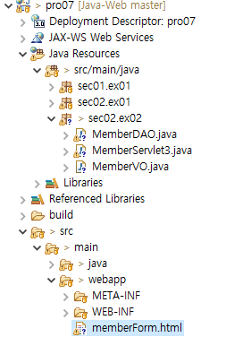
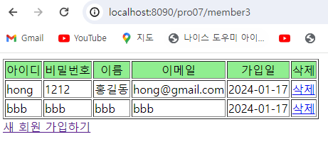

**DataSource 이용해 회원 정보 등록 및 삭제하기**

* 전체 디렉토리

  

* memberForm.html

  ```html
  <!DOCTYPE html>
  <html>
  <head>
  <meta charset="UTF-8">
  <title>회원 가입창</title>
  <script type="text/javascript">
  	function fn_sendMember(){
  		var frmMember = document.frmMember;
  		var id = frmMember.id.value;
  		var pwd = frmMember.pwd.value;
  		var name = frmMember.name.value;
  		var email = frmMember.email.value;
  		
  		if(id.length == 0 || id == "")
  		{
  			alert("아이디는 필수입니다.");
  		}
  		else if(pwd.length == 0 || pwd == ""){
  			alert("비밀번호는 필수입니다.")
  		}
  		else if(name.length == 0 || name == ""){
  			alert("이름은 필수입니다.")
  		}
  		else if(email.length == 0 || email == ""){
  			alert("이메일은 필수입니다.")
  		}
  		else{
  			frmMember.method = "post";
  			frmMember.action = "member3";
  			frmMember.submit();
  		}
  		
  	}
  </script>
  </head>
  <body>
  	<form name = "frmMember">
  		<table>
  			<th>회원 가입창</th>
  			<tr>
  				<td>아이디</td>
  				<td><input type="text" name = "id"></td>
  			</tr>
  			<tr>
  				<td>비밀번호</td>
  				<td><input type="password" name = "pwd"></td>
  			</tr>
  			<tr>
  				<td>이름</td>
  				<td><input type="text" name = "name"></td>
  			</tr>
  			<tr>
  				<td>이메일</td>
  				<td><input type="text" name = "email"></td>
  			</tr>
  		</table>
  		<input type="button" value="가입하기" onClick="fn_sendMember()"  />
  		<input type = "reset" value ="다시 입력">
  		<input type="hidden" name ="command" value ="addMember" />
  	</form>
  </body>
  </html>
  ```

  * 가입하기 버튼을 누르면 fn_sendMember() 함수 호출
  * 모든 정보가 입력되면, member3으로 post 요청이 전달

* MemberDAO.java

  ```java
  package sec02.ex02;
  
  import java.sql.Connection;
  import java.sql.Date;
  import java.sql.PreparedStatement;
  import java.sql.ResultSet;
  import java.util.ArrayList;
  import java.util.List;
  
  import javax.naming.Context;
  import javax.naming.InitialContext;
  import javax.sql.DataSource;
  
  public class MemberDAO {
  	private Connection con;
  	private PreparedStatement pstmt;
  	private DataSource dataFactory;
  	
  	public MemberDAO() {
  		try {
  			Context ctx = new InitialContext();
  			Context envContext = (Context)ctx.lookup("java:/comp/env");
  			dataFactory = (DataSource) envContext.lookup("jdbc/oracle");
  		}catch(Exception e) {
  			e.printStackTrace();
  		}
  	}
  	
  	public void addMember(MemberVO memberVO) {
  		try {
  			System.out.println("hi");
  			Connection con = dataFactory.getConnection();
  			String id = memberVO.getId();
  			String pwd = memberVO.getPwd();
  			String name = memberVO.getName();
  			String email = memberVO.getEmail();
  			
  			String query = "insert into t_member";
  			query +=  " (id, pwd, name, email)";
  			query +=  " values(?,?,?,?)";
  			System.out.println("prepareStatement: " + query);
  			pstmt = con.prepareStatement(query);
  			pstmt.setString(1, id);
  			pstmt.setString(2, pwd);
  			pstmt.setString(3, name);
  			pstmt.setString(4, email);
  			pstmt.executeUpdate();
  			pstmt.close();
  		}catch(Exception e) {
  			e.printStackTrace();
  		}
  	}
  	
  	public void delMember(String id)
  	{
  		try {
  			Connection con = dataFactory.getConnection();
  			System.out.println("삭제할 아이디:" + id);
  			String query = "delete from t_member" + " where id=?";
  			System.out.println("prepareStatememt:" + query);
  			pstmt = con.prepareStatement(query);
  			pstmt.setString(1, id);
  			pstmt.executeUpdate();
  			pstmt.close();
  		}catch(Exception e) {
  			e.printStackTrace();
  		}
  	}
  	
  	public List listMembers()
  	{
  		List list = new ArrayList();
  		try {
  			con = dataFactory.getConnection();
  			String query = "select*from t_member";
  			System.out.println(query);
  			pstmt = con.prepareStatement(query);
  			ResultSet rs = pstmt.executeQuery(query);
  			
  			while(rs.next()) 
  			{
  				String id = rs.getString("id");
  				String pwd = rs.getString("pwd");
  				String name = rs.getString("name");
  				String email = rs.getString("email");
  				Date joinDate = rs.getDate("joinDate");
  				MemberVO vo = new MemberVO();
  				vo.setId(id);
  				vo.setPwd(pwd);
  				vo.setName(name);
  				vo.setEmail(email);
  				vo.setJoinDate(joinDate);
  				list.add(vo);
  			}
  			rs.close();
  			pstmt.close();
  			con.close();
  		}catch(Exception e) {
  			e.printStackTrace();
  		}
  		return list;
  		
  	}
  	
  }
  ```

  * addMember, delMember 메서드 정의

* MemberServlet3.java

  ```java
  package sec02.ex02;
  
  import java.io.IOException;
  import java.io.PrintWriter;
  import java.sql.Date;
  import java.util.List;
  
  import javax.servlet.ServletException;
  import javax.servlet.annotation.WebServlet;
  import javax.servlet.http.HttpServlet;
  import javax.servlet.http.HttpServletRequest;
  import javax.servlet.http.HttpServletResponse;
  
  /**
   * Servlet implementation class MemberServlet
   */
  @WebServlet("/member3")
  public class MemberServlet3 extends HttpServlet {
  	public void doGet(HttpServletRequest request, HttpServletResponse response) throws ServletException, IOException {
  		doHandle(request, response);
  	}
  
  	public void doPost(HttpServletRequest request, HttpServletResponse response) throws ServletException, IOException {
  		doHandle(request, response);
  	}
  	
  	protected void doHandle(HttpServletRequest request, HttpServletResponse response) throws ServletException, IOException {
  		request.setCharacterEncoding("utf-8");
  		response.setContentType("text/html;charset=utf-8");
  		PrintWriter out = response.getWriter();
  		MemberDAO dao = new MemberDAO();
  		String command = request.getParameter("command");
  		
  		if (command != null && command.equals("addMember")) {
  			String _id = request.getParameter("id");
  			String _pwd = request.getParameter("pwd");
  			String _name = request.getParameter("name");
  			String _email = request.getParameter("email");
  			MemberVO vo = new MemberVO();
  			vo.setId(_id);
  			vo.setPwd(_pwd);
  			vo.setName(_name);
  			vo.setEmail(_email);
  			dao.addMember(vo);
  		} else if (command != null && command.equals("delMember")) {
  			String id = request.getParameter("id");
  			dao.delMember(id);
  		}
  		
  		List list = dao.listMembers();
  		out.print("<html><body>");
  		out.print("<table border=1><tr align='center' bgcolor='lightgreen'>");
  		out.print("<td>아이디</td><td>비밀번호</td><td>이름</td><td>이메일</td><td>가입일</td><td>삭제</td></tr>");
  		
  		for (int i = 0; i < list.size(); i++) {
  			MemberVO vo = (MemberVO) list.get(i);
  			String id = vo.getId();
  			String pwd = vo.getPwd();
  			String name = vo.getName();
  			String email = vo.getEmail();
  			Date joinDate = vo.getJoinDate();
  			out.print("<tr><td>" + id + "</td><td>" + pwd + "</td><td>" + name + "</td><td>" + email + "</td><td>" + joinDate + "</td><td>" + 
  			"<a href='/pro07/member3?command=delMember&id=" + id + "'>삭제</a></td></tr>");
  		}
  		out.print("</table></body></html>");
  		out.print("<a href='/pro07/memberForm.html'>새 회원 가입하기</a>");
  	}
  }
  ```

  * command가 addMember인 경우에는 dao의 addMember 메서드에 vo 객체를 전달
  * command가 delMember인 경우에는 dao의 delMember 메서드에 id 값 전달
  
* 결과 화면 (http://localhost:8090/pro07/member3)

  