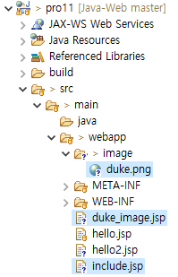

**디렉티브 태그**

* 주로 JSP 페이지에 대한 전반적인 설정 정보를 지정할 때 사용하는 태그
  * **페이지 디렉티브 태그** : JSP 페이지의 전반적인 정보 설정할 때 사용
  * **인클루드 디렉티브 태그** : 공동으로 사용하는 JSP 페이지를 다른 JSP 페이지에 추가할 때 사용
  * **태그라이브 디렉티브 태그** : 개발자나 프레임워크에서 제공하는 태그를 사용할 때 사용

<br>

(1) - 페이지 디렉티브 태그

* directory 구조

  

* hello2.jsp

  ```jsp
  <%@ page language="java" contentType="text/html; charset=utf-8"
      import="java.util.*"
      language="java"
      session="true"
      buffer="8kb"
      autoFlush="true"
      isThreadSafe="true"
      info="(ShoppingMall.........)"
      isErrorPage="false"
      errorPage="" %>
  <!DOCTYPE html>
  <html>
  <head>
  <meta charset="UTF-8">
  <title>페이지 디렉티브 연습</title>
  </head>
  <body>
  	<h1>쇼핑몰 구현 중심 JSP입니다.!!!</h1>
  </body>
  </html>
  ```

* 톰캣 서버 구동 후, http://localhost:8090/pro11/hello2.jsp 접속

  

<br>

(2) - 인클루드 디렉티브 태그

* directory 구조

  

* duke_image.jsp

  ```jsp
  <%@ page language="java" contentType="text/html; charset=UTF-8"
      pageEncoding="UTF-8"%>
  <!DOCTYPE html>
  <html>
  <head>
  <meta charset="UTF-8">
  <title>duke_image</title>
  </head>
  <body>
  	
  </body>
  </html>
  ```

* include.jsp

  ```jsp
  <%@ page language="java" contentType="text/html; charset=UTF-8"
      pageEncoding="UTF-8"%>
  <!DOCTYPE html>
  <html>
  <head>
  <meta charset="UTF-8">
  <title>인클루드 디렉티브</title>
  </head>
  <body>
  	<h1>안녕하세요. 쇼핑몰 중심 JSP 시작입니다!!!</h1><br>
  	<%@ include file="duke_image.jsp" %><br>
  	<h1>안녕하세요. 쇼핑몰 중심 JSP 끝 부분입니다.!!!</h1><br>
  </body>
  </html>
  ```

* 톰캣 서버 구동 후, http://localhost:8090/pro11/include.jsp 접속

  

* include_jsp.java

  

  * 인클루드 디렉티브 태그에 의해 duke_image.jsp의 HTML 태그가 합쳐진 모습