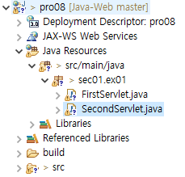
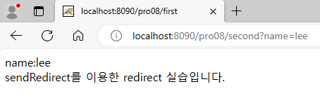
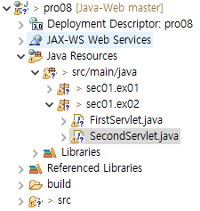
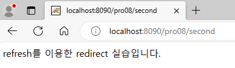
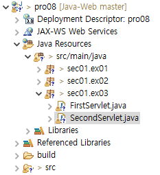
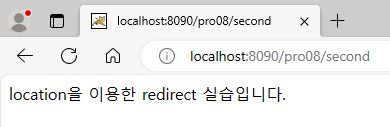
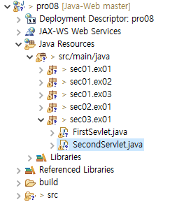
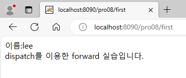

**포워드**

* 하나의 서블릿에서 다른 서블릿이나 JSP와 연동

<br>

1. redirect를 이용한 포워딩

   * directory 구조

     

   * FirstServlet.java

     ```java
     package sec01.ex01;
     
     import java.io.IOException;
     import java.io.PrintWriter;
     
     import javax.servlet.ServletException;
     import javax.servlet.annotation.WebServlet;
     import javax.servlet.http.HttpServlet;
     import javax.servlet.http.HttpServletRequest;
     import javax.servlet.http.HttpServletResponse;
     
     /**
      * Servlet implementation class FirstServlet
      */
     @WebServlet("/first")
     public class FirstServlet extends HttpServlet {
     	public void doGet(HttpServletRequest request, HttpServletResponse response) throws ServletException, IOException {
     		response.setContentType("text/html;charset=utf-8");
     		PrintWriter out = response.getWriter();
     		response.sendRedirect("second?name=lee");
     	}
     
     }
     ```

   * SecondServlet.java

     ```java
     package sec01.ex01;
     
     import java.io.IOException;
     import java.io.PrintWriter;
     
     import javax.servlet.ServletException;
     import javax.servlet.annotation.WebServlet;
     import javax.servlet.http.HttpServlet;
     import javax.servlet.http.HttpServletRequest;
     import javax.servlet.http.HttpServletResponse;
     
     /**
      * Servlet implementation class SecondServlet
      */
     @WebServlet("/second")
     public class SecondServlet extends HttpServlet {
     	public void doGet(HttpServletRequest request, HttpServletResponse response) throws ServletException, IOException {
     		response.setContentType("text/html;charset=utf-8");
     		PrintWriter out = response.getWriter();
     		String name = request.getParameter("name");
     		out.println("<html><body>");
     		out.println("name:" + name);
     		out.println("<br>");
     		out.println("sendRedirect를 이용한 redirect 실습입니다.");
     		out.println("</body></html>");
     	}
     
     }
     ```
   
   * 톰캣 서버 구동 후, http://localhost:8090/pro08/first 접속
   
     

<br>

2. refresh를 이용한 포워딩

   * directory 구조

     

   * FirstServlet.java

     ```java
     package sec01.ex02;
     
     import java.io.IOException;
     import java.io.PrintWriter;
     
     import javax.servlet.ServletException;
     import javax.servlet.annotation.WebServlet;
     import javax.servlet.http.HttpServlet;
     import javax.servlet.http.HttpServletRequest;
     import javax.servlet.http.HttpServletResponse;
     
     /**
      * Servlet implementation class FirstServlet
      */
     @WebServlet("/first")
     public class FirstServlet extends HttpServlet {
     	public void doGet(HttpServletRequest request, HttpServletResponse response) throws ServletException, IOException {
     		response.setContentType("text/html;charset=utf-8");
     		PrintWriter out = response.getWriter();
     		response.addHeader("Refresh", "1;url=second");
     	}
     }
     ```

   * SecondServlet.java

     ```java
     package sec01.ex02;
     
     import java.io.IOException;
     import java.io.PrintWriter;
     
     import javax.servlet.ServletException;
     import javax.servlet.annotation.WebServlet;
     import javax.servlet.http.HttpServlet;
     import javax.servlet.http.HttpServletRequest;
     import javax.servlet.http.HttpServletResponse;
     
     /**
      * Servlet implementation class SecondServlet
      */
     @WebServlet("/second")
     public class SecondServlet extends HttpServlet {
     	public void doGet(HttpServletRequest request, HttpServletResponse response) throws ServletException, IOException {
     		response.setContentType("text/html;charset=utf-8");
     		PrintWriter out = response.getWriter();
     		out.println("<html><body>");
     		out.println("refresh를 이용한 redirect 실습입니다.");
     		out.println("</body></html>");
     	}
     }
     ```

   * 톰캣 서버 구동 후, http://localhost:8090/pro08/first 접속

     

<br>

3. location을 이용한 포워딩

   * directory 구조

     

   * FirstServlet.java

     ```java
     package sec01.ex03;
     
     import java.io.IOException;
     import java.io.PrintWriter;
     
     import javax.servlet.ServletException;
     import javax.servlet.annotation.WebServlet;
     import javax.servlet.http.HttpServlet;
     import javax.servlet.http.HttpServletRequest;
     import javax.servlet.http.HttpServletResponse;
     
     /**
      * Servlet implementation class FirstServlet
      */
     @WebServlet("/first")
     public class FirstServlet extends HttpServlet {
     	public void doGet(HttpServletRequest request, HttpServletResponse response) throws ServletException, IOException {
     		response.setContentType("text/html;charset=utf-8");
     		PrintWriter out = response.getWriter();
     		out.println("<script type='text/javascript'>");
     		out.println("location.href='second'");
     		out.println("</script>");
     	}
     }
     ```

   * SecondServlet.java

     ```java
     package sec01.ex03;
     
     import java.io.IOException;
     import java.io.PrintWriter;
     
     import javax.servlet.ServletException;
     import javax.servlet.annotation.WebServlet;
     import javax.servlet.http.HttpServlet;
     import javax.servlet.http.HttpServletRequest;
     import javax.servlet.http.HttpServletResponse;
     
     /**
      * Servlet implementation class SecondServlet
      */
     @WebServlet("/second")
     public class SecondServlet extends HttpServlet {
     	public void doGet(HttpServletRequest request, HttpServletResponse response) throws ServletException, IOException {
     		response.setContentType("text/html; charset=utf-8");
     		PrintWriter out = response.getWriter();
     		out.println("<html><body>");
     		out.println("location을 이용한 redirect 실습입니다.");
     		out.println("</body></html>");
     	}
     }
     ```

   * 톰캣 서버 구동 후, http://localhost:8090/pro08/first 접속

     

<br>

4. dispatch를 이용한 포워딩
   * redirect와 달리, 클라이언트의 웹 브라우저를 거치지 않고 바로 서버에서 포워딩이 진행됨
   
   * => 즉, 주소창의 URL이 변경되지 않음
   
   * directory 구조
   
     
   
   * FirstServlet.java
   
     ```java
     package sec03.ex01;
     
     import java.io.IOException;
     
     import javax.servlet.RequestDispatcher;
     import javax.servlet.ServletException;
     import javax.servlet.annotation.WebServlet;
     import javax.servlet.http.HttpServlet;
     import javax.servlet.http.HttpServletRequest;
     import javax.servlet.http.HttpServletResponse;
     
     /**
      * Servlet implementation class FirstSevlet
      */
     @WebServlet("/first")
     public class FirstSevlet extends HttpServlet {
     	public void doGet(HttpServletRequest request, HttpServletResponse response) throws ServletException, IOException {
     		request.setCharacterEncoding("utf-8");
     		response.setContentType("text/html;charset=utf-8");
     		RequestDispatcher dispatch = request.getRequestDispatcher("second?name=lee");
     		dispatch.forward(request, response);
     	}
     }
     ```
   
   * SecondServlet.java
   
     ```java
     package sec03.ex01;
     
     import java.io.IOException;
     import java.io.PrintWriter;
     
     import javax.servlet.ServletException;
     import javax.servlet.annotation.WebServlet;
     import javax.servlet.http.HttpServlet;
     import javax.servlet.http.HttpServletRequest;
     import javax.servlet.http.HttpServletResponse;
     
     /**
      * Servlet implementation class SecondServlet
      */
     @WebServlet("/second")
     public class SecondServlet extends HttpServlet {
     	public void doGet(HttpServletRequest request, HttpServletResponse response) throws ServletException, IOException {
     		response.setContentType("text/html;charset=utf-8");
     		PrintWriter out = response.getWriter();
     		String name = request.getParameter("name");
     		out.println("<html><body>");
     		out.println("이름:" + name);
     		out.println("<br>");
     		out.println("dispatch를 이용한 forward 실습입니다.");
     		out.println("</body></html>");
     	}
     }
     ```
   
   * 톰캣 서버 구동 후, http://localhost:8090/pro08/first 접속
   
     
   
     * url이 second로 바뀌지 않은 모습을 통해, 서블릿의 포워드가 서버에서 수행된 것을 알 수 있다.