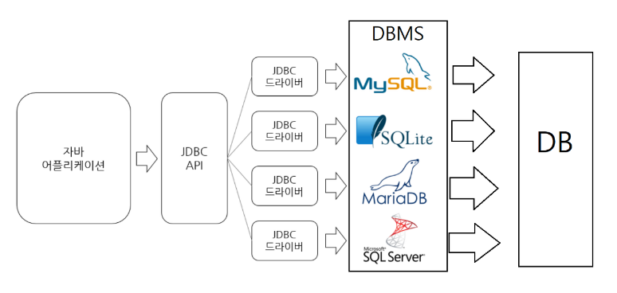

**JDBC(Java Database Connectivity)**

* Java에서 DB에 접근하여 데이터 조회, 삽입, 수정, 삭제를 가능케하는 것을 말한다.

* 즉, Java가 Database를 사용할 수 있도록 연결해주는 응용프로그램 인터페이스인 Java API이다.

* 주된 역할

  * 자바에서 데이터베이스로의 연결을 만듬
  * SQL문 생성
  * SQL문 실행
  * 결과 레코드들을 수정하거나 보는 것 등

  

 

**JDBC Driver**

* 같은 코드여도 다른 데이터베이스에 대해 작동할 수 있는 이유는 각 DBMS를 위한 JDBC Driver가 준비되어 있기 때문이다.
* JDBC Driver를 통해 같은 코드였던 것들이 각각의 DBMS에 맞는 프로토콜로 변환되어 실행된다.

 

**JDBC 프로그래밍 단계**

1. jar 파일 추가
2. 드라이버 로드 Class.forName()
3. 계정에 접속 DriverManger.getConnection(,,)
4. SQL문 분석 conn.prepareStatement(sql)
5. SQL문 실행 select : executeQuery(), insert, delete, update : executeUpdate()
6. 접속 끊기 conn.close()