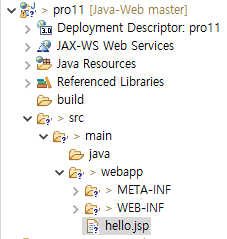
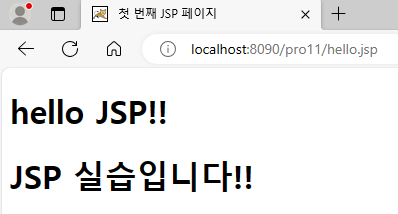

**JSP의 등장 배경**

* 웹 프로그램의 화면 기능이 복잡해지므로 서블릿의 자바 기반으로 화면 기능 구현 시 어려움이 발생
* 그러므로, 비즈니스 로직과 화면을 분리하자!

<br>

**JSP의 구성 요소**

* JSP는 MVC 패턴에서 뷰(View) 기능을 담당한다.
* 따라서,
  * Html, Css, JavaScript
  * JSP 기본 태그
  * JSP 액션 태그
  * 개발자가 직접 만들거나 프레임워크에서 제공하는 커스텀 태그
  * 등으로 구성되어있다.

<br>

**JSP의 3단계 작업 과정**

* JSP는 HTML, CSS, JavaScript는 물론 여러 구성 요소가 있기 때문에, JSP 파일 자체를 브라우저로 전송하면 브라우저는 인식하지 못한다.
* 따라서, JSP는 톰캣 컨테이너에 의해 브라우저로 전송되기 전 실행 단계를 거쳐야 한다.
  1. **변환 단계**: 컨테이너는 JSP 파일을 자바 파일로 변환한다.
  2. **컴파일 단계**: 컨테이너는 변환된 자바 파일을 클래스 파일로 컴파일한다.
  3. **실행 단계**: 컨테이너는 클래스 파일을 실행하여 그 결과를 브라우저로 전송해 출력한다.

<br>

* directory 구조

  

* hello.jsp

  ```jsp
  <%@ page language="java" contentType="text/html; charset=UTF-8"
      pageEncoding="UTF-8"%>
  <!DOCTYPE html>
  <html>
  <head>
  <meta charset="UTF-8">
  <title>첫 번째 JSP 페이지</title>
  </head>
  <body>
  	<h1>hello JSP!!</h1>
  	<h1>JSP 실습입니다!!</h1>
  </body>
  </html>
  ```

* 톰캣 서버 구동 후, http://localhost:8090/pro11/hello.jsp 접속

  

* 동작 원리

  * 이클립스에서 hello.jsp를 생성한 후 톰캣을 실행한다.
  * 브라우저에서 hello.jsp를 요청한다.
  * 브러우저의 요청을 받은 톰캣 컨테이너는 해당 JSP 파일을 읽어 들여와 hello_jsp.java 파일로 변환한다.
  * 그리고 브라우저로 HTML 형식의 결과를 전송하여 화면에 표시한다.

<br>

**JSP 페이지 구성 요소**

* 디렉티브 태그
* 스크립트 요소
* 표현 언어
* 내장 객체
* 액션 태그
* 커스텀 태그