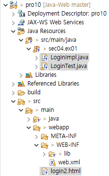
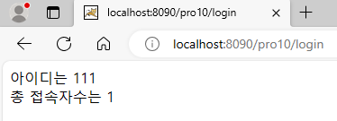
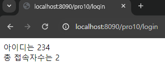
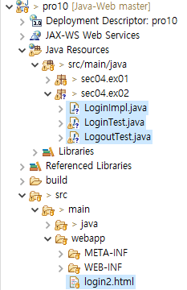
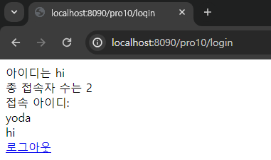

**서블릿 관련 Listener API**

: 서블릿에서는 서블릿에서 발생하는 이벤트에 대해 적절히 처리를 해주는 여러 가지 리스너를 제공한다.

<br>

(1) - HttpSessionBindingListener를 이용해 로그인 접속자수 표시

* directory 구조

  

* login2.html

  ```html
  <!DOCTYPE html>
  <html>
  <head>
  <meta charset="UTF-8">
  <title>로그인창</title>
  </head>
  <body>
  	<form name="frmLogin" method="post" action="login" encType="utf-8">
  		아이디 :<input type="text" name="user_id"><br>
  		비밀번호 :<input type="password" name="user_pw"><br>
  		<input type="submit" value="로그인">
  		<input type="reset" value="다시 입력">
  	</form>
  </body>
  </html>
  ```

* LoginImpl.java

  ```java
  package sec04.ex01;
  
  import javax.servlet.http.HttpSessionBindingEvent;
  import javax.servlet.http.HttpSessionBindingListener;
  
  public class LoginImpl implements HttpSessionBindingListener{
  	String user_id;
  	String user_pw;
  	static int total_user = 0;
  
  	public LoginImpl() {
  		
  	}
  	
  	public LoginImpl(String user_id, String user_pw) {
  		this.user_id = user_id;
  		this.user_pw = user_pw;
  	}
  
  	@Override
  	public void valueBound(HttpSessionBindingEvent event) {
  		//setAttribute()를 통해 특정 name에 대해 새로운 리스너 구현체가 바인딩 될 때 호출됨
  		System.out.println("사용자 접속");
  		++total_user;
  	}
  
  	@Override
  	public void valueUnbound(HttpSessionBindingEvent event) {
  		//removeAttribute()를 통해 리스너 객체가 세션에서 제거될 때 호출됨
  		System.out.println("접속자 해제");
  		--total_user;
  	}
  }
  ```

* LoginTest.java

  ```java
  package sec04.ex01;
  
  import java.io.IOException;
  import java.io.PrintWriter;
  
  import javax.servlet.ServletException;
  import javax.servlet.annotation.WebServlet;
  import javax.servlet.http.HttpServlet;
  import javax.servlet.http.HttpServletRequest;
  import javax.servlet.http.HttpServletResponse;
  import javax.servlet.http.HttpSession;
  
  @WebServlet("/login")
  public class LoginTest extends HttpServlet {
  	protected void doPost(HttpServletRequest request, HttpServletResponse response) throws ServletException, IOException {
  		request.setCharacterEncoding("utf-8");
  		response.setContentType("text/html;charset=utf-8");
  		PrintWriter out = response.getWriter();
  		
  		HttpSession session = request.getSession();
  		String user_id = request.getParameter("user_id");
  		String user_pw = request.getParameter("user_pw");
  		LoginImpl loginUser = new LoginImpl(user_id, user_pw);
  		
  		if(session.isNew()) {
  			session.setAttribute("loginUser", loginUser);
  		}
  		out.println("<head>");
  		out.println("<script type='text/javascript'>");
  		out.println("setTimeout('history.go(0);', 5000"); //setTimeout() 함수를 이용해 5초마다 서블릿에 재용청하여 현재 접속자수 표시
  		out.println("</script>");
  		out.println("</head>");
  		out.println("<html><body>");
  		out.println("아이디는 " + loginUser.user_id + "<br>");
  		out.println("총 접속자수는 " + LoginImpl.total_user + "<br>");
  		out.println("</body></html>");
  	}
  
  }
  ```

* 톰캣 서버 구동 후, http://localhost:8090/login2.html 접속

  

  

<br>

(2) - HttpSessionListener를 이용해 로그인 접속자수 표시

* directory 구조

  

* LoginImpl.java

  ```java
  package sec04.ex02;
  
  import javax.servlet.annotation.WebListener;
  import javax.servlet.http.HttpSessionEvent;
  import javax.servlet.http.HttpSessionListener;
  
  @WebListener //HttpSessionBindingListener를 제외한 Listener를 구현한 모든 이벤트 핸들러는 해당 애너테이션을 통해 Listener로 등록
  public class LoginImpl implements HttpSessionListener{
  	String user_id;
  	String user_pw;
  	static int total_user = 0;
  	
  	public LoginImpl() {
  		
  	}
  
  	public LoginImpl(String user_id, String user_pw) {
  		this.user_id = user_id;
  		this.user_pw = user_pw;
  	}
  
  	@Override
  	public void sessionCreated(HttpSessionEvent se) {
  		//세션 생성 시, 이벤트 처리
  		System.out.println("세션 생성");
  		++total_user;
  	}
  
  	@Override
  	public void sessionDestroyed(HttpSessionEvent se) {
  		//세션 소멸 시, 이벤트 처리
  		System.out.println("세션 소멸");
  		--total_user;
  	}
  
  }
  ```

* LoginTest.java

  ```java
  package sec04.ex02;
  
  import java.io.IOException;
  import java.io.PrintWriter;
  import java.util.ArrayList;
  import java.util.List;
  
  import javax.servlet.ServletContext;
  import javax.servlet.ServletException;
  import javax.servlet.annotation.WebServlet;
  import javax.servlet.http.HttpServlet;
  import javax.servlet.http.HttpServletRequest;
  import javax.servlet.http.HttpServletResponse;
  import javax.servlet.http.HttpSession;
  
  @WebServlet("/login")
  public class LoginTest extends HttpServlet {
  	ServletContext context = null;
  	List user_list = new ArrayList();
  	
  	public void doPost(HttpServletRequest request, HttpServletResponse response) throws ServletException, IOException {
  		request.setCharacterEncoding("utf-8");
  		response.setContentType("text/html;charset=utf-8");
  		context = getServletContext();
  		PrintWriter out = response.getWriter();
  		
  		HttpSession session = request.getSession();
  		String user_id = request.getParameter("user_id");
  		String user_pw = request.getParameter("user_pw");
  		
  		LoginImpl loginUser = new LoginImpl(user_id, user_pw);
  		if(session.isNew()) {
  			session.setAttribute("loginUser", loginUser);
  			user_list.add(user_id);
  			context.setAttribute("user_list", user_list);
  		}
  		
  		out.println("<html><body>");
  		out.println("아이디는 " + loginUser.user_id + "<br>");
  		out.println("총 접속자 수는 " + LoginImpl.total_user + "<br>");
  		out.println("접속 아이디:<br>");
  		List list = (ArrayList) context.getAttribute("user_list");
  		for(int i = 0; i < list.size(); i++) {
  			out.println(list.get(i) + "<br>");
  		}
  		out.println("<a href='logout?user_id="+user_id+"'>로그아웃</a>");
  		out.println("</body></html>");
  	}
  
  }
  ```

* LogoutTest.java

  ```java
  package sec04.ex02;
  
  import java.io.IOException;
  import java.io.PrintWriter;
  import java.util.ArrayList;
  import java.util.List;
  
  import javax.servlet.ServletContext;
  import javax.servlet.ServletException;
  import javax.servlet.annotation.WebServlet;
  import javax.servlet.http.HttpServlet;
  import javax.servlet.http.HttpServletRequest;
  import javax.servlet.http.HttpServletResponse;
  import javax.servlet.http.HttpSession;
  
  @WebServlet("/logout")
  public class LogoutTest extends HttpServlet {
  	ServletContext context;
  	
  	public void doGet(HttpServletRequest request, HttpServletResponse response) throws ServletException, IOException {
  		doHandle(request, response);
  	}
  
  	public void doPost(HttpServletRequest request, HttpServletResponse response) throws ServletException, IOException {
  		doHandle(request, response);
  	}
  	
  	public void doHandle(HttpServletRequest request, HttpServletResponse response) throws ServletException, IOException {
  		request.setCharacterEncoding("utf-8");
  		response.setContentType("text/html;charset=utf-8");
  		context = getServletContext();
  		PrintWriter out = response.getWriter();
  		
  		HttpSession session = request.getSession();
  		String user_id = request.getParameter("user_id");
  		session.invalidate();
  		
  		List user_list = (ArrayList) context.getAttribute("user_list");
  		user_list.remove(user_id);
  		context.removeAttribute("user_list");
  		context.setAttribute("user_list", user_list);
  		out.println("<br>로그아웃했습니다.");
  	}
  
  }
  ```

* 톰캣 서버 구동 후, http://localhost:8090/pro10/login2.html 접속

  