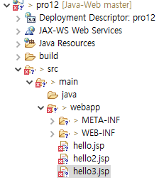
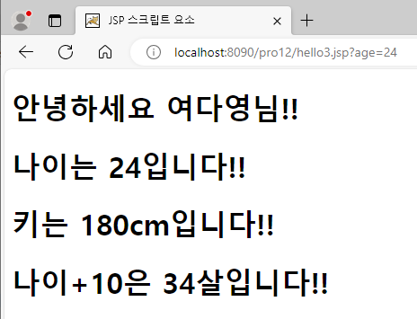
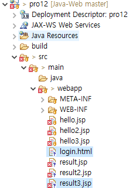
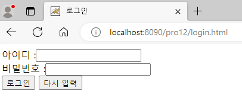
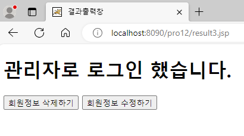
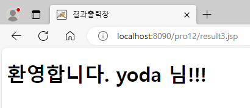
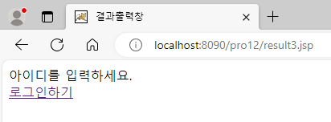

**JSP 스크립트 요소**

* JSP 페이지에서 여러 가지 동적인 처리를 제공하는 기능
* '<% %> - 스크립트릿' 기호 안에 자바 코드 구현

<br>

* 디렉토리 구조

  

* hello3.jsp

  ```jsp
  <%@ page language="java" contentType="text/html; charset=UTF-8"
      pageEncoding="UTF-8"%>
  <!-- 선언문 -->
  <%!
  	String name = "여다영";
  	String getName() {
  		return name;
  	}
  %>
  <!-- 스크립틀릿 -->
  <%
  	String age = request.getParameter("age");
  %>
  <!DOCTYPE html>
  <html>
  <head>
  <meta charset="UTF-8">
  <title>JSP 스크립트 요소</title>
  </head>
  <body>
  <!-- 표현식 -->
  	<h1>안녕하세요 <%=name %>님!!</h1>
  	<h1>나이는 <%=age %>입니다!!</h1>
  	<h1>키는 <%=180 %>cm입니다!!</h1>
  	<h1>나이+10은 <%=Integer.parseInt(age) + 10 %>살입니다!!</h1>
  </body>
  </html>
  ```

  - **선언문**: JSP에서 변수나 메서드를 선언할 때 사용
    - <%! 멤버 변수 or 멤버 메서드 %>
  - **스크립트릿**: JSP에서 자바 코드를 작성할 때 사용
    - <% 자바 코드 %>
  - **표현식**: JSP에서 변수의 값을 출력할 때 사용
    - <%= 값 or 자바 변수 or 자바 식 %>

* 톰캣 서버 구동 후, http://localhost:8090/pro12/hello3.jsp 접속

  

<br>

**로그인 구현**

* 디렉토리 구조

  

* result3.jsp

  ```jsp
  <%@ page language="java" contentType="text/html; charset=UTF-8"
      pageEncoding="UTF-8"%>
  <%
  	request.setCharacterEncoding("utf-8");
  	String user_id = request.getParameter("user_id");
  	String user_pw = request.getParameter("user_pw");
  %>
  <!DOCTYPE html>
  <html>
  <head>
  <meta charset="UTF-8">
  <title>결과출력창</title>
  </head>
  <body>
  	<%
  		if(user_id == null || user_id.length() == 0) {
  			%>
  			아이디를 입력하세요.<br>
  			<a href="/pro12/login.html">로그인하기</a>
  			<%
  		}else {
  			if(user_id.equals("admin")) {
  				%>
  				<h1>관리자로 로그인 했습니다.</h1>
  				<input type=button value="회원정보 삭제하기" />
  				<input type=button value="회원정보 수정하기" />
  				<% 
  			} else {
  				%>
  				<h1>환영합니다. <%=user_id %> 님!!!</h1>
  				<%
  			}
  		}
  	%>
  </body>
  </html>
  ```

* 톰캣 서버 구동 후, http://localhost:8090/pro12/login.html 접속

  

  

  

  