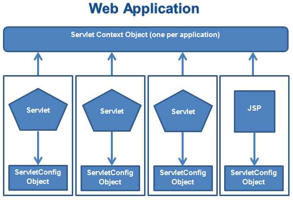

**(서블릿 확장 API)웹 프로그래밍 개발 시 유용한 기능을 제공하는 클래스들**

 

1. ServletContext 클래스
   * javax.servlet.ServletContext로 정의되어 있다.
   * 컨텍스트(웹 애플리케이션)마다 하나의 ServletContext가 생성된다.
   * 서블릿과 컨테이너간의 연동을 위해 사용한다.
   * 서블릿끼리 자원을 공유하는 데 사용한다.
   * 컨테이너 실행 시 생성되고 컨테이너 종료 시 소멸된다.
2. ServletConfig 클래스
   * javax.servlet 패키지에 인터페이스로 선언되어 있다.
   * 각 서블릿 객체에 대해 생성된다.
   * 각 서블릿에서만 접근할 수 있으며 공유는 불가능하다.
   * ServletContext 객체를 얻는 기능과 서블릿에 대한 초기화 작업 기능을 제공한다.
   * 서블릿과 동일하게 생성되고 서블릿이 소멸되면 같이 소멸된다.