**서블릿(Servlet)**

* 톰캣과 같은 WAS(Web Application Server)가 처음 나왔을 때, 웹 브라우저 요청을 스레드 방식으로 처리하던 기술
* 기존의 정적인 웹 프로그램의 문제점을 보와하여 동적인 여러 가지 기능을 제공
* 컨테이너에서 실행
* 자바로 만들어져 자바의 특징(객체 지향)을 가짐

 

**서블릿의 생명주기 메서드**

| 생명주기 단계 | 호출 메서드           | 특징                                                         |
| ------------- | --------------------- | ------------------------------------------------------------ |
| 초기화        | init()                | - 서블릿 요청 시 맨 처음 한 번만 호출 - 서블릿 생성 시 초기화 작업을 주로 수행 |
| 작업 수행     | doGet() doPost() | - 서블릿 요청 시 매번 호출 - 실제로 클라이언트가 요청하는 작업을 수행 |
| 종료          | destroy()             | - 서블릿이 기능 수행 후 메모리에서 소멸될 때 호출 - 서블릿의 마무리 작업을 주로 수행 |

 

**FirstServlet을 이용한 실습**

* 이클립스에서 서블릿을 만들고 실행하는 과정
  * 사용자 정의 서블릿 클래스 만들기
  * 서블릿 생명주기 메서드 구현
  * 서블릿 매핑 작업
  * 웹 브라우저에서 서블릿 매핑 이름으로 요청하기

 

**1. 사용자 정의 서블릿 클래스 만들기**

* 톰캣의 servlet-api.jar 클래스 패스 설정하기

  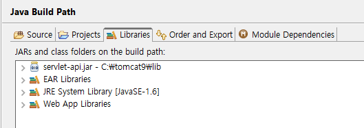

  * 서블릿 API들은 톰캣의 servlet-api.jar 라이브러리로 제공되므로 이클립스의 pro05 프로젝트 생성 후 반드시 클래스 패스 설정

* FirstServlet 클래스 생성 (디렉터리 구조)

  

  * (Package)sec01.ex01 > (Class)FirstServlet.java

 

**2. 서블릿 생명주기 메서드 구현**

* HttpServlet을 상속받고 3개의 생명주기 메서드 구현

  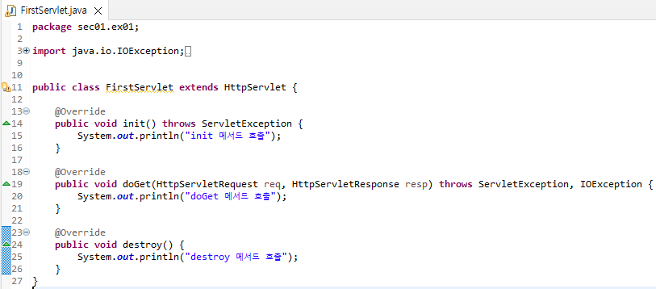

 

**3. 서블릿 매핑 작업**

* web.xml에 servlet-class와 url 매핑

  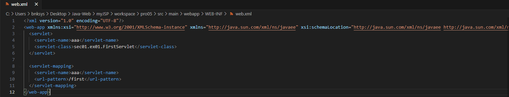

 

**4. 톰캣에 프로젝트 실행**

* 톰캣 서버에 프로젝트 추가

  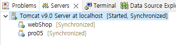

* 서버 구동 및 http://localhost:8090/pro05/first 접속

  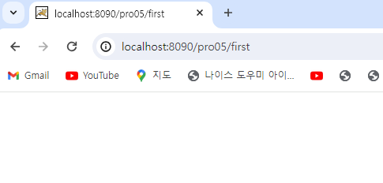

* 이클립스 콘솔 창 확인

  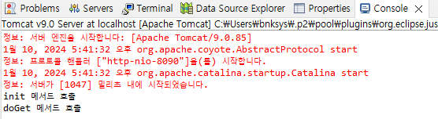

 

**다수의 서블릿 매핑하기**

* SecondServlet Class 생성

  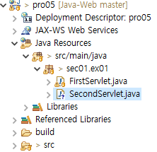

  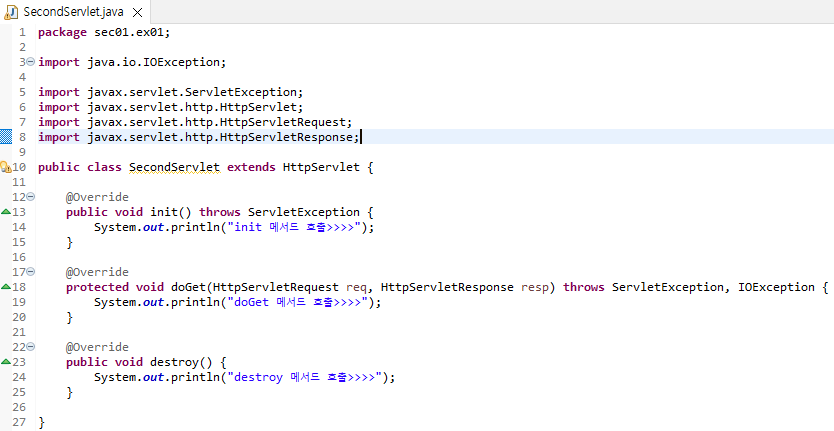

* web.xml에 class와 url 매핑

  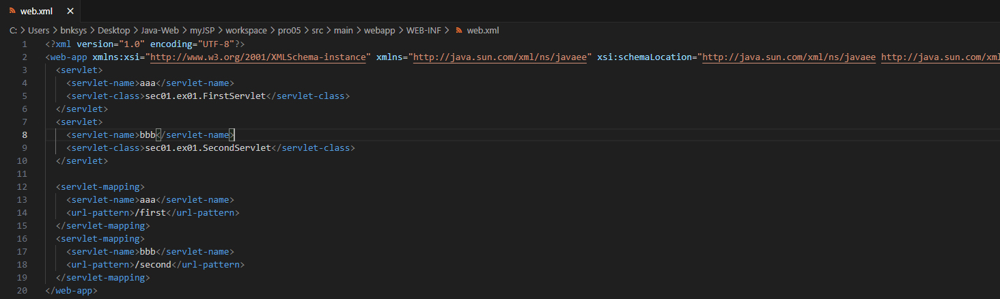

* 톰캣 서버 구동 후, http://localhost:8090/pro05/second 접속

  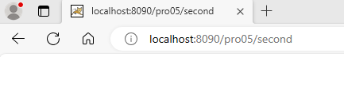

* 이클립스 콘솔 창 확인

  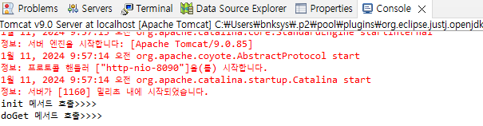

 

**애너테이션을 이용한 서블릿 매핑**

* web.xml에 서블릿을 설정할 경우 복잡해진다는 단점이 있다.
* 그래서 애너테이션을 이용해 서블릿 클래스에 직접 설정할 수 있다.

 

* Class가 아닌 Servlet으로 ThirdServlet 생성

  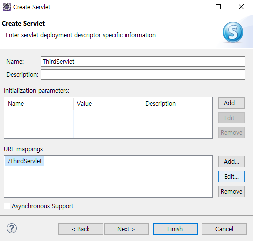

  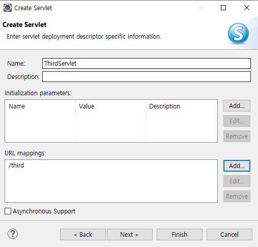

  * url을 /third로 바꿔주고

  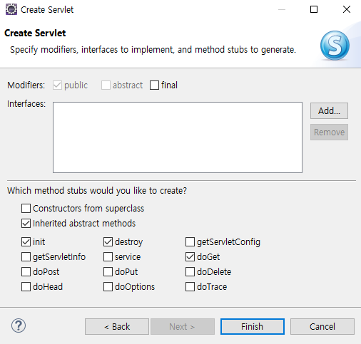

  * 오버라이딩 할 생명주기 메서드 체크

  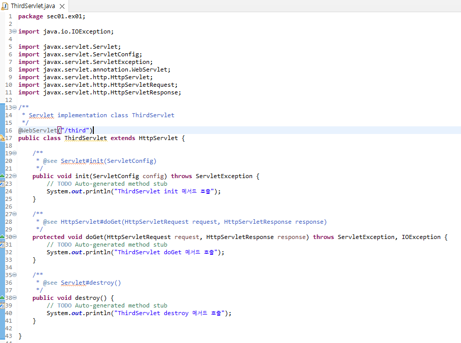

  * WebServlet 애너테이션을 볼 수 있고, 필요한 메서드 수정

* 톰캣 서버를 구동하고 http://localhost:8090/pro05/third 접속

  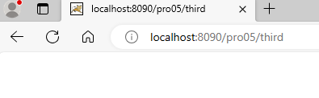

* 이클립스 콘솔 창 확인

  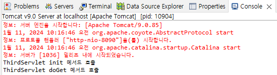
