**서블릿의 비즈니스 처리 과정**

1. 클라이언트로부터 요청을 받는다.
2. 데이터베이스 연동과 같은 비즈니스 로직을 처리한다.
3. 처리 결과를 클라이언트에게 돌려준다.

 

**서블릿의 데이터베이스 연동하기**

**(1) DataSource - DriverManager 사용**

1. SQL Developer에서 회원 정보 테이블 생성 및 추가

   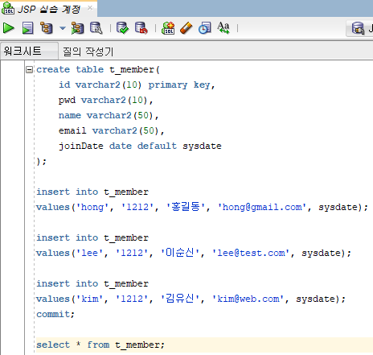

   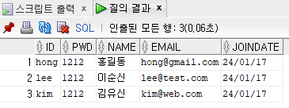

2. 오라클 데이터베이스와 연동하는 데 필요한 드라이버인 ojdbc6.jar를 복사 붙여넣기

   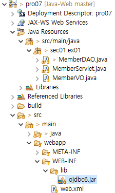

3. MemberVO.java

   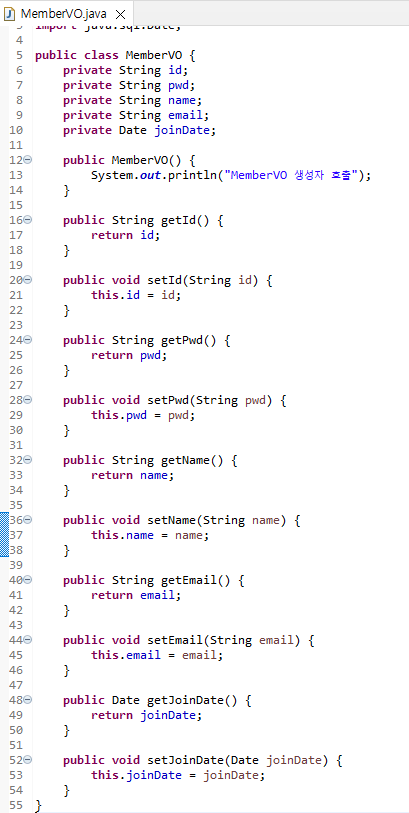

4. MemberDAO.java

   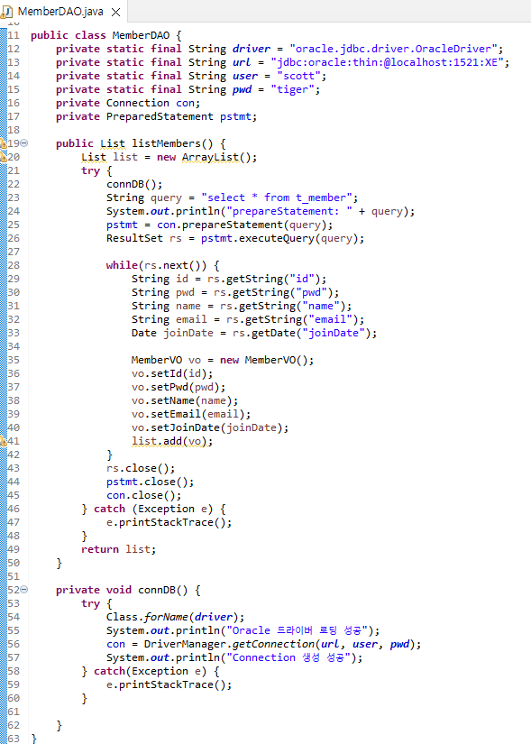

5. MemberServlet.java

   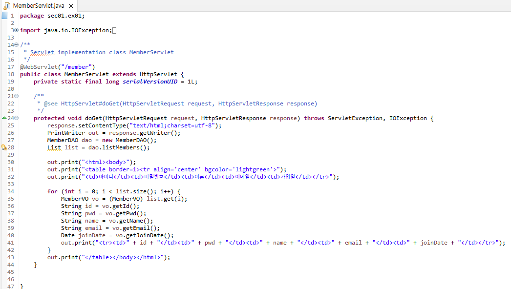

6. 톰캣 서버 구동 후, http://localhost:8090/pro07/member로 접속

   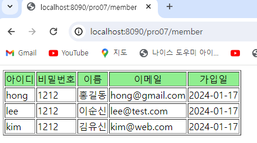

7. 콘솔창 확인

   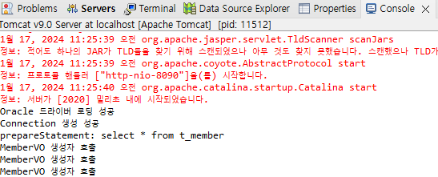

 

**느낀점**

* MemberVO는 전송 객체?와 같은 느낌을 받았다. 임의의 형태의 객체에 담아서 데이터를 보내고 싶을 때 해당 객체를 만드는 것 같다.
* MemberDAO는 데이터베이스에 접근하고 SQL문을 실행할 때 사용하는 것 같다.
* MemberServlet은 Controller 역할을 하는 것 같다.

 

**(2) DataSource - Connection Pool 사용**

* 웹 애플리케이션이 필요할 때마다 데이터베이스를 연결하여 작업하면 사용자가 많아질수록 데이터베이스 연결에 시간이 많이 걸린다.
* => 웹 애플리케이션이 실행됨과 동시에 연동할 데이터베이스와의 연결을 미리 설정하고 연결시킨 상태를 유지한다.
  * 애플리케이션 실행 시 미리 ConnectorPool 객체를 생성한 후 데이터베이스와 연결을 맺는다. (javax.sql.DataSource 클래스 이용)
  * 그리고 애플리케이션은 데이터베이스 연동 작업이 발생하면 이 ConnectionPool 객체를 이용해서 작업한다. (JNDI를 이용)

 

1. 톰캣 DataSource 설정

   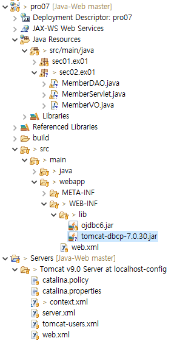

   * ConnectionPool 기능을 제공하는 DBCP 라이브러리를 다운받아 복사 붙여넣기

   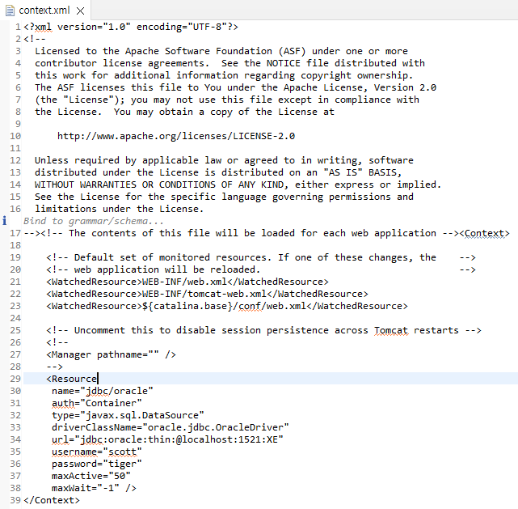

   * context.xml에 Resource 태그를 이용해 톰캣 실행 시 연결할 데이터베이스 설정
   * name 속성의 jdbc/oracle로 DataSource에 접근

2. MemberDAO.java

   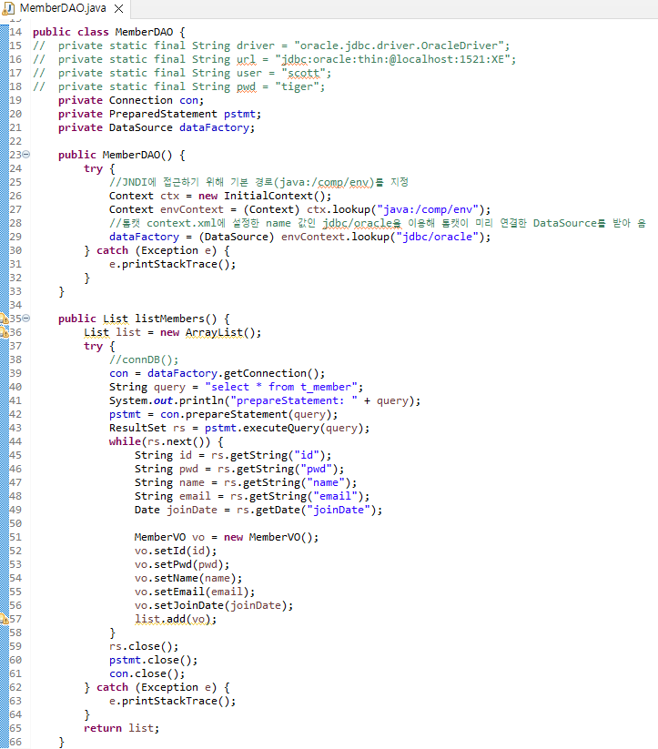

   * 톰캣의 DataSource로 연동해 회원 정보 조회

3. 톰캣 서버 구동 후, http://localhost:8090/pro07/membr2 접속

   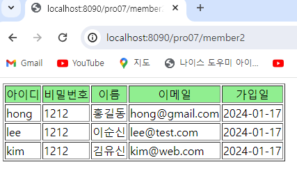

 

**느낀점**

* context.xml에 미리 ConnectionPool을 정의해서, 톰캣 서버가 실행됨과 동시에 실행할 데이터베이스 정보를 적어두는 것 같다.
* DAO 객체에 JNDI를 사용해 해당 데이터베이스에 접속하고, 필요한 쿼리문을 작성하는 것 같다.
