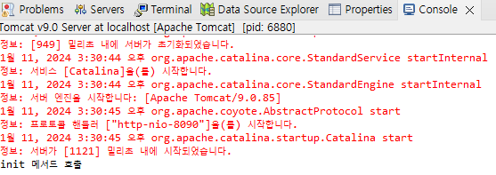

**서블릿 응답과 요청 수행 API**

* 요청이나 응답과 관련된 API는 모두 javax.servlet.http 패키지에 있다.
* 요청 관련 API: javax.servlet.http.HttpServletRequest 클래스
* 응답 관련 API: javax.servlet.http.HttpServletResponse 클래스

 

**form 태그로 전송된 데이터를 받아 오는 메서드**

* String getParameter(String name)

  : name 값을 알고 있을 때 name 대한 전송 값을 받아올 때 사용

* String[] getParameterValues(String name)

  : 같은 name에 대해 여러 개의 값을 얻을 때 사용

* Enumeration getParameterNames()

  : name 값을 모를 때 사용

 

**HttpSevletRequest로 요청 처리**

* pro06 dynamic project 생성 및 class path에 servlet-api.jar 지정

* 디렉터리 구조

  

* login.html

  

  * action="login" : 입력된 데이터를 서블릿 매핑 이름이 login인 서블릿으로 전송

* LoginServlet.java

  

  * HttpServletRequest 클래스의 getParameter() 메서드로 데이터를 받아옴

* 톰캣 서버 구동 후, http://localhost:8090/pro06/login.html 접속

  

* 이클립스 콘솔 창 확인

  

 

**여러 개의 값을 전송할 때의 요청 처리**

* 디렉터리 구조

  

* input.html

  

* InputServlet.java

  

* 톰캣 서버 구동 후, http://localhost:8090/pro06/input.html 접속

  

* 이클립스 콘솔 창 확인

  

 

**getParameterNames() 메서드를 이용한 요청 처리**

* 디렉터리 구조

  

* input.html

  

  * action="input"을 action="input2"로 수정

* InputServlet2.java

  

* 톰캣 서버 구동 후, http://localhost:8090/pro06/input.html 접속

  

* 이클립스 콘솔 창 확인

  

 

**서블릿의 응답 처리 방법**

* 서버(서블릿)에서 웹 브라우저로 데이터를 전송할 때, 어떤 종류의 데이터를 전송하는지 알려줘야 한다.
* 톰캣 컨테이너에서 미리 설정해 놓은 데이터 종류들을 MIME-TYPE(마임타입)이라고 한다.
* HTML로 전송 시: text/html
* 일반 텍스트로 전송 시: text/plain
* XML 데이터로 전송 시: application/xml
* 새로운 종류의 데이터를 지정하고 싶다면 CATALINA_HOME\conf\web.xml에 추가

 

**HttpSevletResponse를 이용한 서블릿 응답**

1. setContentType()을 이용해 MIME-TYPE 지정
2. 데이터를 출력할 PrintWriter 객체 생성
3. 출력 데이터를 HTML 형식으로 작성
4. PrintWriter의 print()나 println()을 이용해 데이터 출력

 

* 디렉터리 구조

  

* login.html

  

  * action="login"을 action="login2"로 수정

* LoginServlet2.java

  

* 톰캣 서버 구동 후, http://localhost:8090/login.html 접속

  

* submit 후 결과창 및 콘솔 확인

  

  