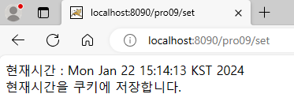
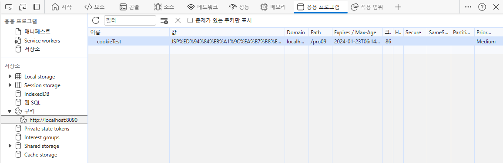

**세션 트래킹**

* HTTP 프로토콜은 서버-클라이언트 통신 시 stateless 방식으로 통신을 하기 때문에, 각 웹 페이지나 서블릿끼리 상태나 정보를 공유하지 않는다.
* 또, 서블릿의 비즈니스 로직 처리 기능을 이용해 데이터베이스를 연동하면, 동시 사용자 수가 많아질수록 연동 속도가 영향을 받는다.
* 따라서 어떤 정보들은 클라이언트 PC나 서버의 메모리에 저장해두고 사용하면, 프로그램을 좀 더 빠르게 실행시키고 웹 페이지 사이의 상태나 정보를 공유할 수 있다.

<br>

1. hidden 태그를 이용한 웹 페이지 연동

   * HTML의 hidden 태그를 이용해 클라이언트의 데이터를 서버에 보냄

   * directory 구조

     

   * login.html

     ```java
     <!DOCTYPE html>
     <html>
     <head>
     <meta charset="UTF-8">
     <title>로그인창</title>
     </head>
     <body>
     	<form name="frmLogin" method="post" action="login" encType="UTF-8">
     		아이디 :<input type="text" name="user_id"><br>
     		비밀번호 :<input type="password" name="user_pw"><br>
     		<input type="submit" value="로그인">
     		<input type="reset" value="다시 입력">
     		<input type="hidden" name="user_address" value="서울시 성북구">
     		<input type="hidden" name="user_email" value="test@gmail.com">
     		<input type="hidden" name="user_hp" value="010-111-2222">
     	</form>
     </body>
     </html>
     ```

     * hidden 태그를 사용해 데이터 전달

   * LoginServlet.java

     ```java
     package sec01.ex01;
     
     import java.io.IOException;
     import java.io.PrintWriter;
     
     import javax.servlet.ServletConfig;
     import javax.servlet.ServletException;
     import javax.servlet.annotation.WebServlet;
     import javax.servlet.http.HttpServlet;
     import javax.servlet.http.HttpServletRequest;
     import javax.servlet.http.HttpServletResponse;
     
     @WebServlet("/login")
     public class LoginServlet extends HttpServlet {
     	public void init(ServletConfig config) throws ServletException {
     		System.out.println("init 메서드 호출");
     	}
     
     	public void doPost(HttpServletRequest request, HttpServletResponse response) throws ServletException, IOException {
     		request.setCharacterEncoding("utf-8");
     		response.setContentType("text/html;charset=utf-8");
     		PrintWriter out = response.getWriter();
     		
     		String user_id = request.getParameter("user_id");
     		String user_pw = request.getParameter("user_pw");
     		String user_address = request.getParameter("user_address");
     		String user_email = request.getParameter("user_email");
     		String user_hp = request.getParameter("user_hp");
     		
     		String data = "안녕하세요!<br> 로그인하셨습니다.<br><br>";
     		data += "<html><body>";
     		data += "아이디 : " + user_id;
     		data += "<br>";
     		data += "비밀번호 : " + user_pw;
     		data += "<br>";
     		data += "주소 : " + user_address;
     		data += "<br>";
     		data += "이메일 : " + user_email;
     		data += "<br>";
     		data += "휴대전화 : " + user_hp;
     		data += "</body></html>";
     		out.print(data);
     	}
     
     	public void destroy() {
     		System.out.println("destroy 메서드 호출");
     	}
     
     }
     ```

     * getParameter()를 통해 hidden 태그로 전송된 데이터도 출력

   * 톰캣 서버 구동 후, http://localhost:8090/pro09/login.html 접속

     

     

<br>

2. URL Rewriting을 이용한 세션 트래킹

   * GET 방식으로 URL 뒤에 정보를 붙여서 다른 페이지로 전송

   * directory 구조

     

   * LoginServlet.java

     ```java
     package sec01.ex02;
     
     import java.io.IOException;
     import java.io.PrintWriter;
     import java.net.URLEncoder;
     
     import javax.servlet.ServletConfig;
     import javax.servlet.ServletException;
     import javax.servlet.annotation.WebServlet;
     import javax.servlet.http.HttpServlet;
     import javax.servlet.http.HttpServletRequest;
     import javax.servlet.http.HttpServletResponse;
     
     @WebServlet("/login")
     public class LoginServlet extends HttpServlet {
     	public void init(ServletConfig config) throws ServletException {
     		System.out.println("init 메서드 호출");
     	}
     
     	public void doPost(HttpServletRequest request, HttpServletResponse response) throws ServletException, IOException {
     		request.setCharacterEncoding("utf-8");
     		response.setContentType("text/html;charset=utf-8");
     		PrintWriter out = response.getWriter();
     		
     		String user_id = request.getParameter("user_id");
     		String user_pw = request.getParameter("user_pw");
     		String user_address = request.getParameter("user_address");
     		String user_email = request.getParameter("user_email");
     		String user_hp = request.getParameter("user_hp");
     		
     		String data = "안녕하세요!<br> 로그인하셨습니다.<br><br>";
     		data += "<html><body>";
     		data += "아이디 : " + user_id;
     		data += "<br>";
     		data += "비밀번호 : " + user_pw;
     		data += "<br>";
     		data += "주소 : " + user_address;
     		data += "<br>";
     		data += "이메일 : " + user_email;
     		data += "<br>";
     		data += "휴대전화 : " + user_hp;
     		data += "<br>";
     		
     		user_address = URLEncoder.encode(user_address, "utf-8"); //GET 방식으로 한글을 전송하기 위해 인코딩
     		data += "<a href='/pro09/second?user_id="+user_id+"&user_pw="+user_pw+"&user_address="+user_address+"'>두 번째 서블릿으로 보내기</a>";
     		data += "</body></html>";
     		out.print(data);
     	}
     
     	public void destroy() {
     		System.out.println("destroy 메서드 호출");
     	}
     
     }
     ```

     * SecondServlet으로 URL을 통해 유저 아이디, 비밀번호, 주소를 전달

   * SecondServlet.java

     ```java
     package sec01.ex02;
     
     import java.io.IOException;
     import java.io.PrintWriter;
     
     import javax.servlet.ServletConfig;
     import javax.servlet.ServletException;
     import javax.servlet.annotation.WebServlet;
     import javax.servlet.http.HttpServlet;
     import javax.servlet.http.HttpServletRequest;
     import javax.servlet.http.HttpServletResponse;
     
     @WebServlet("/second")
     public class SecondServlet extends HttpServlet {
     	public void init(ServletConfig config) throws ServletException {
     		System.out.println("init 메서드 호출");
     	}
     
     	public void destroy() {
     		System.out.println("destroy 메서드 호출");
     	}
     
     	public void doGet(HttpServletRequest request, HttpServletResponse response) throws ServletException, IOException {
     		request.setCharacterEncoding("utf-8");
     		response.setContentType("text/html;charset=utf-8");
     		PrintWriter out = response.getWriter();
     		
     		String user_id = request.getParameter("user_id");
     		String user_pw = request.getParameter("user_pw");
     		String user_address = request.getParameter("user_address");
     		
     		out.println("<html><body>");
     		if(user_id != null && user_id.length() != 0) {
     			out.println("이미 로그인 상태입니다!<br><br>");
     			out.println("첫 번째 서블릿에서 넘겨준 아이디 : " + user_id + "<br>");
     			out.println("첫 번째 서블릿에서 넘겨준 비밀번호 : " + user_pw + "<br>");
     			out.println("첫 번째 서블릿에서 넘겨준 주소 : " + user_address + "<br>");
     			out.println("</body></html>");
     		}
     		else {
     			out.println("로그인 하지 않았습니다.<br><br>");
     			out.println("다시 로그인하세요!!<br>");
     			out.println("<a href='/pro09/login.html'>로그인창으로 이동하기</a>");
     		}
     	}
     
     }
     ```

     * 넘겨받은 user_id 유무로, 다르게 출력

   * 톰캣 서버 구동 후, http://localhost:8090/pro09/login.html 접속

     * user_id가 있는 경우

       

       

       

     * user_id가 없는 경우

       

       

       

<br>

3. 쿠키를 이용한 웹 페이지 연동 

   * 쿠키란 웹 페이지들 사이의 공유 정보를 클라이언트 PC에 저장해 놓고 필요할 때 여러 웹 페이지들이 공유해서 사용할 수 있도록 매개 역할을 하는 방법

   * 저장 정보 용량에 제한이 있고, 보안에 취약

   * 도메인 당 쿠키가 생성(웹 사이트 당 하나의 쿠키)

   * | 속성                   | Persistence 쿠키                             | Session 쿠키                                 |
     | ---------------------- | -------------------------------------------- | -------------------------------------------- |
     | 생성 위치              | 파일로 생성                                  | 브라우저 메모리에 생성                       |
     | 종료 시기              | 쿠키를 삭제하거나 쿠키 설정 값이 종료된 경우 | 브라우저를 종료한 경우                       |
     | 최초 접속 시 전송 여부 | 최초 접속 시 서버로 전송                     | 최초 접속 시 서버로 전송되지 않음            |
     | 용도                   | 로그인 유무 또는 팝업창을 제한할 때          | 사이트 접속 시 Session 인증 정보를 유지할 때 |

     * Session 쿠키
       * 쿠키 생성 시 setMaxAge()메서드 인자 값이 음수거나, setMaxAge() 메서드를 사용하지 않는 경우
     * Persistence 쿠키
       * 쿠키 생성 시 setMaxAge()메서드 인자 값으로 양수 지정

<br>

(1) - Persistence 쿠키

* 브라우저로 사이트에 최초 접속하면, 웹 서버에서 쿠키를 생성해 클라이언트로 전송
* 그러면 브라우저는 쿠키를 파일로 저장
  * HttpServletResponse의 addCookie()
* 이후 재접속하면, 서버는 크라우저에게 쿠키 전송을 요청하고, 브라우저는 쿠키 정보를 서버에 전송
  * HttpServletRequest의 getCookie()

<br>

* directory 구조

  

* SetCookieValue.java

  ```java
  package sec02.ex01;
  
  import java.io.IOException;
  import java.io.PrintWriter;
  import java.net.URLEncoder;
  import java.util.Date;
  
  import javax.servlet.ServletException;
  import javax.servlet.annotation.WebServlet;
  import javax.servlet.http.Cookie;
  import javax.servlet.http.HttpServlet;
  import javax.servlet.http.HttpServletRequest;
  import javax.servlet.http.HttpServletResponse;
  
  @WebServlet("/set")
  public class SetCookieValue extends HttpServlet {
  	public void doGet(HttpServletRequest request, HttpServletResponse response) throws ServletException, IOException {
  		response.setContentType("text/html;charset=utf-8");
  		PrintWriter out = response.getWriter();
  		Date d = new Date();
  		Cookie c = new Cookie("cookieTest", URLEncoder.encode("JSP프로그래밍입니다.", "utf-8")); //cookieTest이름으로 JSP프로그래밍입니다.라는 정보 저장
  		c.setMaxAge(24*60*60); //쿠키 유효시간을 24시간으로 설정
  		
  		response.addCookie(c); //addCookie() 메서드를 이용해 생성된 쿠키를 브라우저로 전송
  		out.println("현재시간 : " + d);
  		out.println("<br>현재시간을 쿠키에 저장합니다.");
  	}
  
  }
  ```

* GetCookieValue.java

  ```java
  package sec02.ex01;
  
  import java.io.IOException;
  import java.io.PrintWriter;
  import java.net.URLDecoder;
  
  import javax.servlet.ServletException;
  import javax.servlet.annotation.WebServlet;
  import javax.servlet.http.Cookie;
  import javax.servlet.http.HttpServlet;
  import javax.servlet.http.HttpServletRequest;
  import javax.servlet.http.HttpServletResponse;
  
  @WebServlet("/get")
  public class GetCookieValue extends HttpServlet {
  	public void doGet(HttpServletRequest request, HttpServletResponse response) throws ServletException, IOException {
  		response.setContentType("text/html;charset=utf-8");
  		PrintWriter out = response.getWriter();
  		
  		Cookie[] allCookies = request.getCookies(); //getCookies() 메서드를 호출해 브라우저로부터 쿠키를 전달받음
  		for(int i = 0; i < allCookies.length; i++) {
  			if (allCookies[i].getName().equals("cookieTest")) {
  				//cookieTest 이름을 통해 값을 가져옴
  				out.println(URLDecoder.decode(allCookies[i].getValue(), "utf-8"));
  			}
  		}
  	}
  
  }
  ```

* 톰캣 서버 구동 후, http://localhost:8090/pro09/set 접속

  

  * 현재 시간으로 쿠키가 생성됨

* http://localhost:8090/get 접속

  

  

  * cookieTest 이름으로 값을 가져오고, Cookie가 브라우저에 잘 저장된 것을 볼 수 있다.

<br>

(2) - Session 쿠키

* 쿠키를 파일에 저장하는 것이 아니라 브라우저가 사용하는 메모리에 저장
* setMaxAge() 메서드를 이용해 유효 시간을 -1로 설정하면 된다.

<br>

* SetCookieValue.java

  ```java
  package sec02.ex01;
  
  import java.io.IOException;
  import java.io.PrintWriter;
  import java.net.URLEncoder;
  import java.util.Date;
  
  import javax.servlet.ServletException;
  import javax.servlet.annotation.WebServlet;
  import javax.servlet.http.Cookie;
  import javax.servlet.http.HttpServlet;
  import javax.servlet.http.HttpServletRequest;
  import javax.servlet.http.HttpServletResponse;
  
  @WebServlet("/set")
  public class SetCookieValue extends HttpServlet {
  	public void doGet(HttpServletRequest request, HttpServletResponse response) throws ServletException, IOException {
  		response.setContentType("text/html;charset=utf-8");
  		PrintWriter out = response.getWriter();
  		Date d = new Date();
  		Cookie c = new Cookie("cookieTest", URLEncoder.encode("JSP프로그래밍입니다.", "utf-8")); //cookieTest이름으로 JSP프로그래밍입니다.라는 정보 저장
  		c.setMaxAge(24*60*60); //쿠키 유효시간을 24시간으로 설정
  		
  		response.addCookie(c); //addCookie() 메서드를 이용해 생성된 쿠키를 브라우저로 전송
  		out.println("현재시간 : " + d);
  		out.println("<br>현재시간을 쿠키에 저장합니다.");
  	}
  
  }
  ```

* 쿠키 생성 화면

  

<br>

Persistence 쿠키와 Session 쿠키의 차이점

* Persistence 쿠키는 파일로 저장되기 때문에, 브라우저 창을 끄고 다시 켜도 설정한 maxAge에 도달하지 않았다면 쿠키가 그래도 유지된다.
* Session 쿠키는 브라우저가 사용하는 메모리에 저장되기 때문에, 브라우저 창을 끄고 다시 키면 쿠키가 사라져있다.

<br>

(3) - 쿠키를 이용해 팝업창 제한하기

* 팝업창 제어는 서버에서 쿠키를 다루지 않고 자바스크립트를 이용해 쿠키에 직접 접근

* directory 구조

  

* popUp.html

  ```html
  <!DOCTYPE html>
  <html>
  <head>
  <meta charset="UTF-8">
  <script type="text/javascript">
  	function setPopUpStart(obj) {
  		if(obj.checked==true) {
  			//checkbox가 체크되면, 쿠키 유효시간 한 달 동안 notShowPop 속성이 true를 유지한다.
  			var expireDate = new Date();
  			expireDate.setMonth(expireDate.getMonth() + 1);
  			document.cookie = "notShowPop=" + "true" + ";path=/;" + "expires=" + expireDate.toGMTString();
  			window.close();
  		}
  	}
  </script>
  </head>
  <body>
  	알림 팝업창입니다.
  	<br><br><br><br><br><br><br>
  	<form>
  		<input type="checkbox" onClick="setPopUpStart(this)">오늘 더 이상 팝업창 띄우지 않기
  	</form>
  </body>
  </html>
  ```

* popupTest.html

  ```html
  <!DOCTYPE html>
  <html>
  <head>
  <meta charset="UTF-8">
  <title>자바스크립트에서 쿠키 사용</title>
  <script type="text/javascript">
  	//브라우저에 웹 페이지가 load될 때, pageLoad함수를 호출한다.
  	window.onload = pageLoad;
  	function pageLoad() {
  		var notShowPop = getCookieValue();
  		if(notShowPop != "true") {
  			//쿠키의 notShowPop가 true가 아니면, 팝업을 띄운다.
  			window.open("popUp.html", "pop", "width=400, height=500, history=no, resizable=no, scrollbars=yes, menubar=no");
  		}
  	}
  	
  	function getCookieValue() {
  		//result의 기본 값을 false로 둔다.
  		var result = "false";
  		if(document.cookie != "") {
  			//cookie가 존재한다면,
  			//document의 cookie 속성으로 쿠키 정보를 가져오고, 분리 및 정규식을 통해 쿠키 값을 가져온다.
  			cookie = document.cookie.split(";");
  			for(var i = 0; i < cookie.length; i++) {
  				element = cookie[i].split("=");
  				value = element[0];
  				value = value.replace(/^\s*/, '');
  				if(value == "notShowPop") {
  					//해당 정보를 result에 저장한다.
  					result = element[1];
  				}
  			}
  		}
  		//result를 반환한다.
  		return result;
  	}
  	
  	//쿠키의 notShowPop 속성을 false로 수정한다.
  	function deleteCookie() {
  		document.cookie = "notShowPop=" + "false" + ";path=/; expires=-1";
  	}
  </script>
  </head>
  <body>
  	<form>
  		<input type="button" value="쿠키삭제" onClick="deleteCookie()">
  	</form>
  </body>
  </html>
  ```

* 톰캣 서버 구동 후, http://localhost:8090/pro09/popupTest.html 접속

  

<br>

4. 세션을 이용한 웹 페이지 연동 기능
   * 정보가 서버의 메모리에 저장된다.
   * 쿠키보다 보안에 유리하다.
   * 브라우저(사용자) 당 한 개의 세션(세션 id)이 생성된다.
   * 세션은 유효 시간을 가진다.(기본 유효 시간은 30분)
   * 로그인 상태 유지 기능이나 쇼핑몰의 장바구니 담기 기능 등에 주로 사용된다.

<br>

* 실행과정
  * 브라우저가 서버에 최초 접속하면, 서버의 서블릿은 세션 객체를 생성한 후 세션 id를 브라우저에 전송
  * 브라우저는 이 세션 id를 브라우저가 사용하는 세션 쿠키에 저장(쿠키 이름은 jsessionId)
  * 재접속하여 세션 쿠키에 저장된 세션 id(jsessionId)를 다시 서버로 전송하면, 서버에서는 전송된 세션 id를 이용해 브라우저의 세션 객체에 접근하여 브라우저에 대한 작업을 수행

<br>

(1) - 서블릿에서 세션 API 이용하기

* directory 구조

  

* SessionTest.java

  ```java
  package sec03.ex01;
  
  import java.io.IOException;
  import java.io.PrintWriter;
  import java.util.Date;
  
  import javax.servlet.ServletException;
  import javax.servlet.annotation.WebServlet;
  import javax.servlet.http.HttpServlet;
  import javax.servlet.http.HttpServletRequest;
  import javax.servlet.http.HttpServletResponse;
  import javax.servlet.http.HttpSession;
  
  @WebServlet("/sess")
  public class SessionTest extends HttpServlet {
  	public void doGet(HttpServletRequest request, HttpServletResponse response) throws ServletException, IOException {
  		response.setContentType("text/html;charset=utf-8");
  		PrintWriter out = response.getWriter();
  		//세션 객체를 생성하거나 기존 세션 반환
  		HttpSession session = request.getSession();
  		out.println("세션 아이디 : " + session.getId() + "<br>");
  		out.println("최초 세션 생성 시각 : " + new Date(session.getCreationTime()) + "<br>");
  		out.println("최근 세션 접근 시각 : " + new Date(session.getLastAccessedTime()) + "<br>");
  		if(session.isNew()) {
  			out.print("새 세션이 만들어졌습니다.");
  		}
  	}
  
  }
  ```

* 톰캣 서버 구동 후, http://localhost:8090/sess 접속

  

* 재접속

  
  
* 세션 유효시간 확인(web.xml)

  

* 세션 유효시간 변경하기(SessionTest2.java)

  ```java
  package sec03.ex02;
  
  import java.io.IOException;
  import java.io.PrintWriter;
  import java.util.Date;
  
  import javax.servlet.ServletException;
  import javax.servlet.annotation.WebServlet;
  import javax.servlet.http.HttpServlet;
  import javax.servlet.http.HttpServletRequest;
  import javax.servlet.http.HttpServletResponse;
  import javax.servlet.http.HttpSession;
  
  @WebServlet("/sess2")
  public class SessionTest2 extends HttpServlet {
  	protected void doGet(HttpServletRequest request, HttpServletResponse response) throws ServletException, IOException {
  		response.setContentType("text/html;charset=utf-8");
  		PrintWriter out = response.getWriter();
  		
  		HttpSession session = request.getSession();
  		out.println("세션 아이디 : " + session.getId() + "<br>");
  		out.println("최초 세션 생성 시각 : " + new Date(session.getCreationTime()) + "<br>");
  		out.println("최근 세션 접근 시각 : " + new Date(session.getLastAccessedTime()) + "<br>");
  		out.println("기본 세션 유효 시간 : " + session.getMaxInactiveInterval() + "<br>");
  		session.setMaxInactiveInterval(5); //세션의 유효 시간을 5초로 설정
  		out.println("세션 유효 시간 : " + session.getMaxInactiveInterval() + "<br>");
  		if(session.isNew()) {
  			out.print("새 세션이 만들어졌습니다.");
  		}
  		
  	}
  
  }
  ```

* 세션이 5초마다 새롭게 생성

  

* 강제로 세션을 삭제하는 기능(SessionTest3.java)

  ```java
  package sec03.ex03;
  
  import java.io.IOException;
  import java.io.PrintWriter;
  import java.util.Date;
  
  import javax.servlet.ServletException;
  import javax.servlet.annotation.WebServlet;
  import javax.servlet.http.HttpServlet;
  import javax.servlet.http.HttpServletRequest;
  import javax.servlet.http.HttpServletResponse;
  import javax.servlet.http.HttpSession;
  
  @WebServlet("/sess3")
  public class SessionTest3 extends HttpServlet {
  	protected void doGet(HttpServletRequest request, HttpServletResponse response) throws ServletException, IOException {
  		response.setContentType("text/html;charset=utf-8");
  		PrintWriter out = response.getWriter();
  		
  		HttpSession session = request.getSession();
  		out.println("세션 아이디 : " + session.getId() + "<br>");
  		out.println("최초 세션 생성 시각 : " + new Date(session.getCreationTime()) + "<br>");
  		out.println("최근 세션 접근 시각 : " + new Date(session.getLastAccessedTime()) + "<br>");
  		out.println("세션 유효 시간 : " + session.getMaxInactiveInterval() + "<br>");
  		if(session.isNew()) {
  			out.print("새 세션이 만들어졌습니다.");
  		}
  		session.invalidate(); //invalidate()를 호출해 생성된 세션 객체를 강제로 삭제
  	}
  
  }
  ```

* 재요청 할 때마다 다른 세션이 생성

  

  